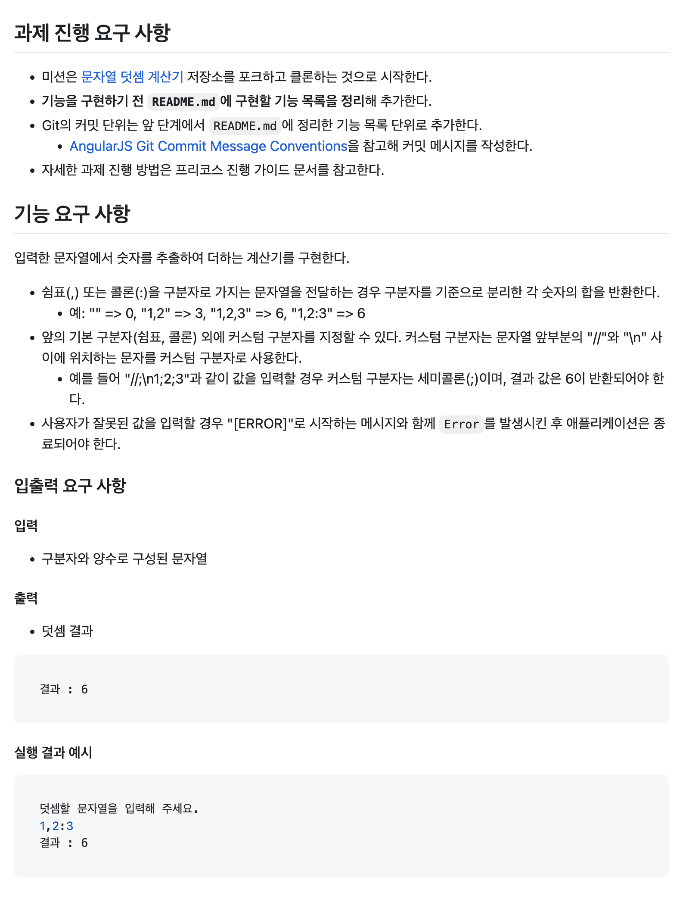

# javascript-calculator-precourse

- # 과제 요구사항
	- 
	- ## 과제 분석
		- 본인 상태 : AI 없이 코딩하던 시절엔 C 언어만 다뤘음.  AI가 등장하고 웹개발 할 수 있을것 같아 패기롭게 도전. 3년간 바이브 코딩 진행.
		- 요구사항을 어떻게 이해했나.
			- 문제: 숫자와 구분자로 조합된 문자열이 입력으로 주어지면, 숫자 부분만 추출하여 더하라.
			- 구분자가 될 수 있는 것: 콜론, 콤마, //와 /n사이의 문자
			- 유의 사항: 양수 있다고 가정. (음수 처리 안 해도 됨)
			- 에러 처리: 사용자가 구분자 아닌 값을 입력하는 경우. (=>"[Error]"만 반환해도 됨)
		- 방향: 기본 구분자, custom 구분자 등록 -> 문자열에서 각 문자를 iter하며 숫자인지 확인 -> 숫자가 아니라면, 구분자인지 확인 | 숫자라면, tracking_sum에 *10하여 더함 (end) -> 구분자라면 total += tracking_sum; tracking_sum = 0 | 구분자가 아니라면 Error 반환
		- 고민:
			- 문자열 순회 방법
				- for (const ch of "string") {
				      // ch = "s" → "t" → "r" → "i" → "n" → "g"  
				  } 가능함  
				- 신기한 부분: js엔 char 타입이 없어서 각 문자도 문자열임
			- 구분자인지, 숫자인지 판단하는 방법
				- ascii 문자 비교
		- 예외 및 가정:
			- 사용자가 설마 구분자로 숫자를 두진 않겠지?
			- 구분자가 등록됨을 어떻게 알지? => // 발견 시 구분자라고 생각 -> /n 발견시 등록
				- 입력이 "//\n"이면 구분자가 ""가 되는건가? 이것도 에런가?
			- 구분자는 한 글자인가? 여러 글자도 가능한가?
			- => 구분자는 한 글자이며, 숫자가 아니며, "//n"은 구분자를 등록하지 않았다고 가정.
	- ## 진행 로그
		- ### [[Oct 15th, 2025]] 과제 분석
		- 
	- ## 메인 트러블 슈팅
	- ## 과제 진행 소감
		- 느낀 점:
		- 배운 점:
			- commit 작성 방식
			  logseq.order-list-type:: number
				- 의문:
				  logseq.order-list-type:: number
		- 많은 시간을 투자한 부분:
		-
		-
		-
		-
		-